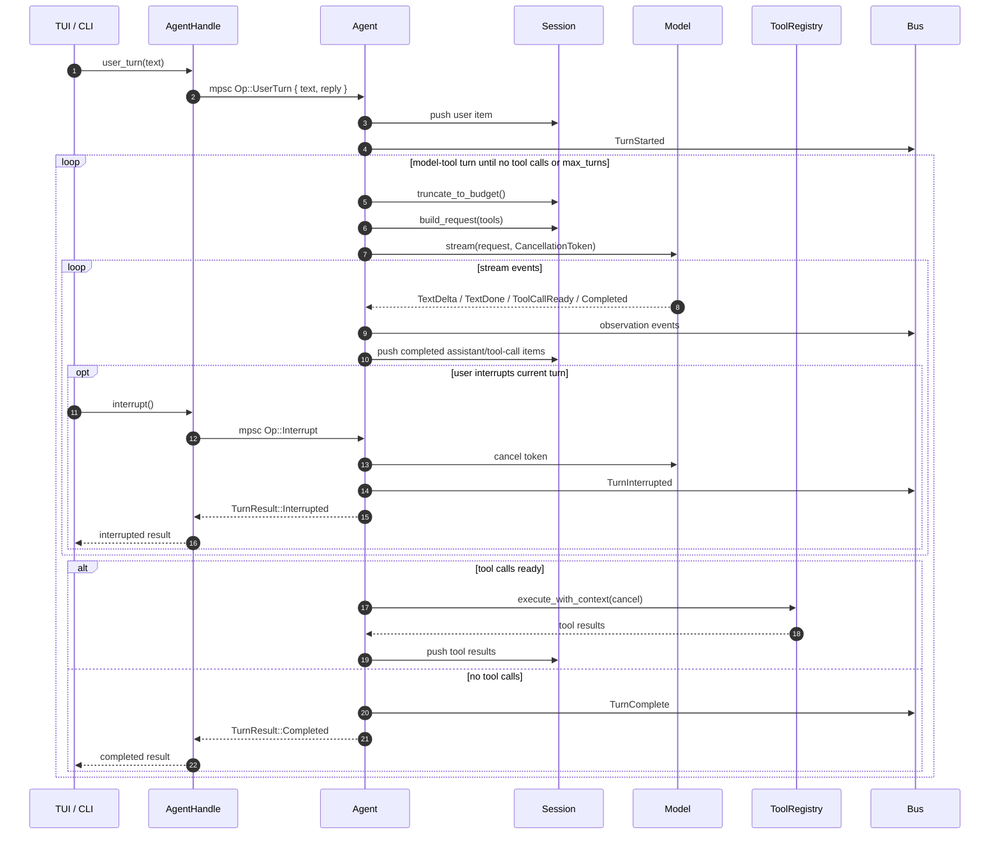

# ADR-0004: Minimal Op enum as Agent turn entry point

**Date**: 2026-04-25
**Status**: accepted
**Deciders**: project lead

## Context

The Agent needs to handle multiple user actions: sending text, interrupting generation, and
potentially switching models or canceling tool execution. These actions come from different UI
paths but must be processed consistently by the Agent loop.

Reference implementations:
- **Claude Code** keeps the main conversation flow as a simple turn loop. The main conversation
  turn is not modeled as a protocol-level shutdown/task operation.
- **Codex CLI** uses Rust-friendly queue pairs (`submit(Op)` + event receiver), `mpsc`-style
  submission loops, and `CancellationToken`-based interruption.

## Decision

We adopt Claude Code's minimal turn-loop shape and use Codex CLI as the Rust implementation
reference for channels, handles, and interruption via `CancellationToken`.

In particular, funcode should not introduce a JavaScript-style `AbortController` abstraction.
Rust cancellation should use mature ecosystem primitives, currently
`tokio_util::sync::CancellationToken`.

`Op` is intentionally limited to user interaction with the active Agent turn:

```rust
pub enum Op {
    UserTurn {
        text: String,
        reply: Option<oneshot::Sender<TurnResult>>,
    },
    Interrupt,
}
```

`Op` should not contain lifecycle commands such as `Shutdown`. Closing the application, dropping
the Agent runtime, or replacing an Agent instance is an App/runtime concern, not an Agent turn
domain operation.

External callers may use either:

- `Agent::submit(&mut self, op: Op)` for focused domain tests.
- `AgentHandle` for TUI/App integration. `AgentHandle` sends `Op` through a Tokio `mpsc` queue
  and uses a `oneshot` reply for `TurnResult`.

Interrupt uses a turn-scoped `tokio_util::sync::CancellationToken` so the Agent can propagate
explicit cancellation into the model streaming path.

## Preferred Turn Loop Shape

The preferred behavior follows Claude Code's simple turn loop, while interruption follows Codex's
Rust cancellation style:



The important boundary is that `Interrupt` is a turn-level control signal. It cancels the current
turn but does not imply application shutdown, session destruction, or Agent runtime teardown.

## Alternatives Considered

### Alternative 1: Separate methods for all actions
```rust
impl Agent {
    async fn send_message(&mut self, text: String);
    fn interrupt(&self);
    fn switch_model(&mut self, model: String);
}
```
- **Pros**: Each method is self-documenting; no match boilerplate.
- **Cons**: State management is dispersed; race conditions between methods are harder to reason
  about. No single serialization point.
- **Why not**: A single entry point provides a natural serialization boundary and makes state
  transitions explicit.

### Alternative 2: Codex-style protocol Op including lifecycle
```rust
pub enum Op {
    UserTurn { ... },
    Interrupt,
    Shutdown,
}
```
- **Pros**: Matches Codex's protocol-driven architecture. The UI can ask core to clean up and wait
  for a terminal shutdown event.
- **Cons**: `Shutdown` is lifecycle control, not a conversation turn operation. It broadens `Op`
  beyond the Agent domain and couples App/runtime teardown to the turn API.
- **Why not**: funcode prefers Claude's simpler turn loop. Lifecycle should be handled by App or
  a private runtime command if needed later.

### Alternative 3: Message-passing via channel
```rust
tx.send(AgentCommand::UserTurn(text)).await;
```
- **Pros**: Fully decoupled; Agent runs in its own task.
- **Cons**: Requires a dedicated Agent task and reply channels.
- **Decision update**: This is now used for TUI/App integration through `AgentHandle`, but it is an
  implementation boundary. It does not change the minimal domain semantics of `Op`.

## Consequences

### Positive
- `Op` stays aligned with Agent turn semantics: user turn + interrupt.
- TUI/App code can submit from another task through `AgentHandle` without borrowing `&mut Agent`.
- Interrupt signal is non-blocking and propagates naturally through async call chains.
- `CancellationToken` is the ecosystem-standard primitive for cooperative async cancellation.
- Lifecycle remains outside the public turn API.

### Negative
- The channel-backed handle adds `mpsc`/`oneshot` plumbing around the simple turn loop.
- Explicit App shutdown semantics are deferred until there is a concrete lifecycle owner.

### Risks
- If future lifecycle needs become complex, add a private runtime command or App-level runtime
  handle rather than expanding public `Op` with shutdown semantics by default.
